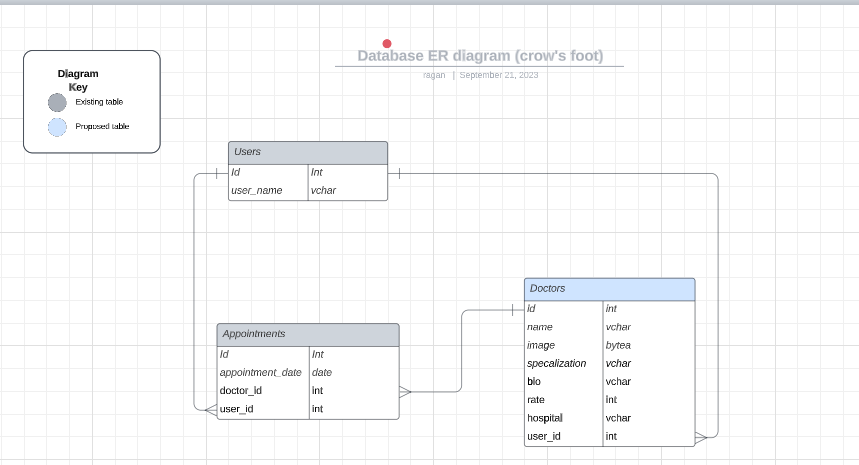

<a name="readme-top"></a>

<div align="center">

  <br/>
  <h1>Doctor's Appointment</h1>

</div>

## 📗 Table of Contents

- [📖 About the Project](#about-project)
  - [Schema](#-schema)
  - [🛠 Built With ](#-built-with-)
    - [Tech Stack ](#tech-stack-)
    - [Key Features ](#key-features-)
  - [🚀 Live Demo](#live-demo)
  - [Video Presentation](#video-presentation)
- [💻 Getting Started ](#-getting-started-)
  - [Prerequisites](#prerequisites)
  - [Setup](#setup)
  - [Run Tests](#run-tests)
  - [👥 Authors ](#-authors-)
- [🔭 Future Features:](#-future-features)
  - [🤝 Contributing ](#-contributing-)
  - [⭐️ Show your support ](#️-show-your-support-)
  - [🙏 Acknowledgments ](#-acknowledgments-)
  - [📝 License ](#-license-)

<!-- PROJECT DESCRIPTION -->

# Doctor's Appointment <a name="about-project"></a>

> The Backend for the Doctor's Appointment app. Built using Ruby on Rails.

<!-- Database SCHEMA -->

# Database Schema <a name="schema"></a>

The database designed is based on this schema


#### Link to [Frontend](https://github.com/abel-tefera/doctor-appointment-front-end)

## 🛠 Built With <a name="built-with"></a>

### Tech Stack <a name="tech-stack"></a>

<details>
  <summary>Framework</summary>
  <ul>
    <li><a href="https://rubyonrails.org/">Ruby on Rails</a></li>
  </ul>
</details>

<!-- Features -->

### Key Features <a name="key-features"></a>

- Authentication
- CRUD
- Image Upload

<p align="right">(<a href="#readme-top">back to top</a>)</p>

## 🚀 Live Demo <a name="live-demo"></a>

> Here's the link to my deployed project:

- [Coming Soon](#)

## Video Presentation <a name="video-presentation"></a>

Click on this [Coming Soon](#) to view the video walkthrough of this project

<p align="right">(<a href="#readme-top">back to top</a>)</p>

<!-- GETTING STARTED -->

## 💻 Getting Started <a name="getting-started"></a>

### Prerequisites

In order to run this project you need:

- Installed Git.
- Installed Ruby
- Installed Ruby on Rails
- Create a local directory that you want to clone the repository.
- Open the command prompt in the created directory.
- On the terminal run this command git clone https://github.com/abel-tefera/doctor-appointment-back-end.git

### Setup

Clone this repository to your desired folder:

```sh
git clone https://github.com/abel-tefera/doctor-appointment-back-end.git
```

```sh
cd doctor-appointment-back-end
```

```sh
bundle install
```

```sh
bundle exec rails db:create db:migrate
```

```sh
rails s
```

### Run Tests

N/A

<p align="right">(<a href="#readme-top">back to top</a>)</p>

<!-- AUTHORS -->

## 👥 Authors <a name="authors"></a>

### 👤 **Abel Tefera**:

- GitHub: [@abel-tefera](https://github.com/abel-tefera)
- Twitter: [@twitter](https://twitter.com/abelteferabelay)
- LinkedIn: [@linkedin](https://www.linkedin.com/in/abel-t-belay/)

### 👤 **Christian Momo**

- GitHub: [@github](https://github.com/momo-87)
- Twitter: [@twitter](https://twitter.com/Momo_yde)
- LinkedIn: [@linkedin](https://www.linkedin.com/in/christian-momo/)

👤 **Inoulen**

- GitHub: [@K Inoulen Shanongba](https://github.com/lenkon)

### 👤 **Ragan Hailu**:

- GitHub: [@ragan](https://github.com/ragangithub)
- LinkedIn: [@ragan](https://www.linkedin.com/in/raganhailu/)

# 🔭 Future Features:

- Proper authentication
- Authorization

## 🤝 Contributing <a name="contributing"></a>

Contributions, issues, and feature requests are welcome!

Feel free to check the [issues page](../../issues/).

<p align="right">(<a href="#readme-top">back to top</a>)</p>

<!-- SUPPORT -->

## ⭐️ Show your support <a name="support"></a>

If you liked this project, give it a ⭐️ and kindly send to me an e-mail expressing it, it would make our day and fuel our motivation.

<p align="right">(<a href="#readme-top">back to top</a>)</p>

<!-- ACKNOWLEDGEMENTS -->

## 🙏 Acknowledgments <a name="acknowledgements"></a>

We would like to thank Microverse for this opportunity.

Original design idea by [Murat Korkmaz on Behance](https://www.behance.net/gallery/26425031/Vespa-Responsive-Redesign).

<p align="right">(<a href="#readme-top">back to top</a>)</p>

<!-- LICENSE -->

## 📝 License <a name="license"></a>

This project is [MIT](./LICENSE) licensed.

<p align="right">(<a href="#readme-top">back to top</a>)</p>
